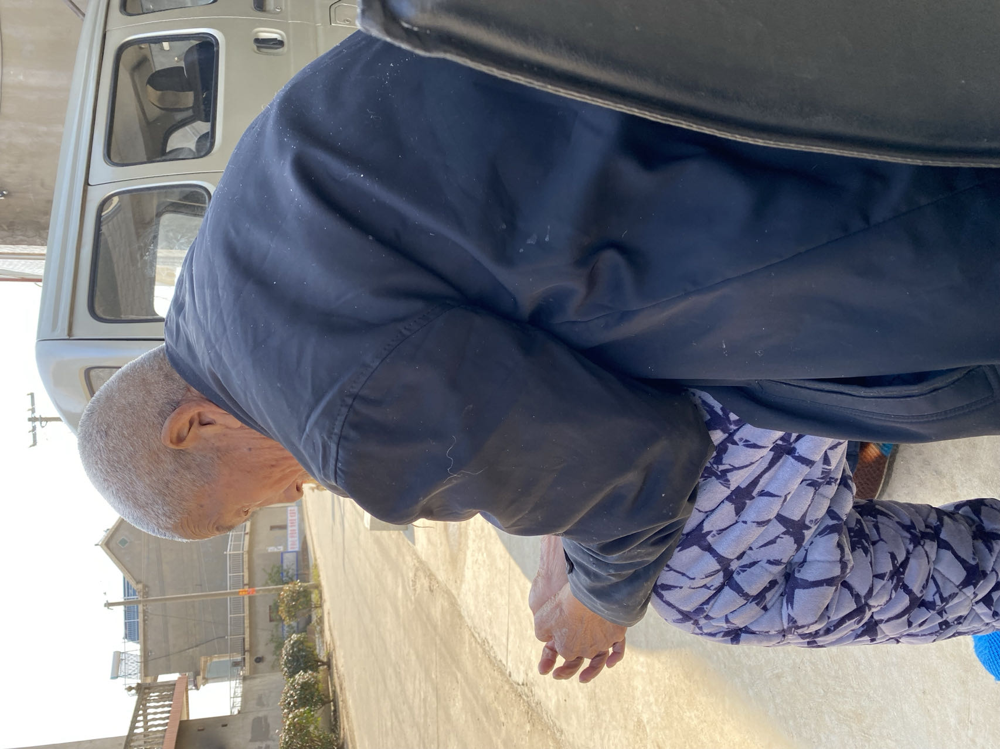
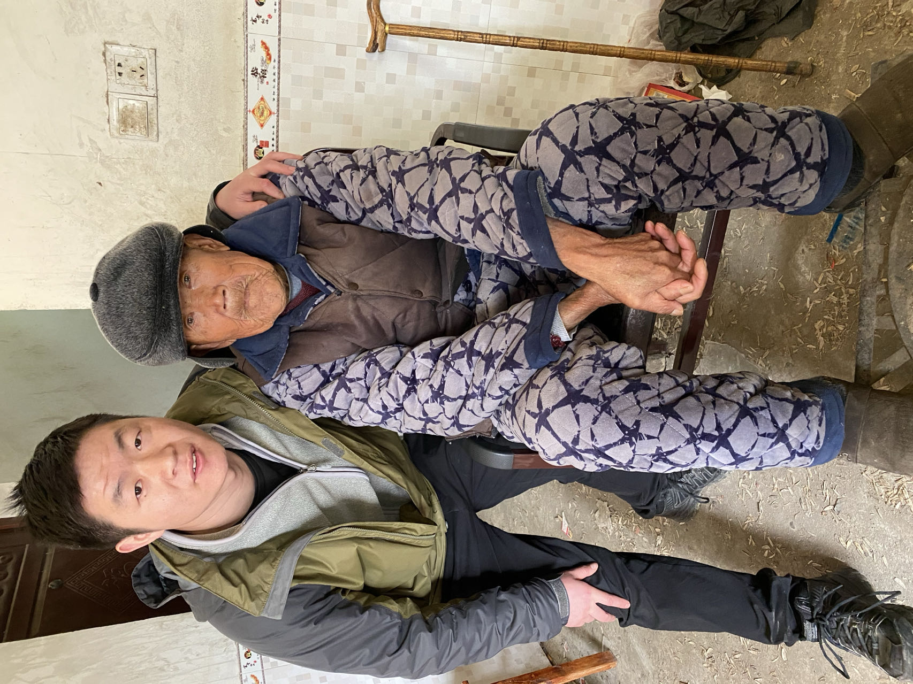
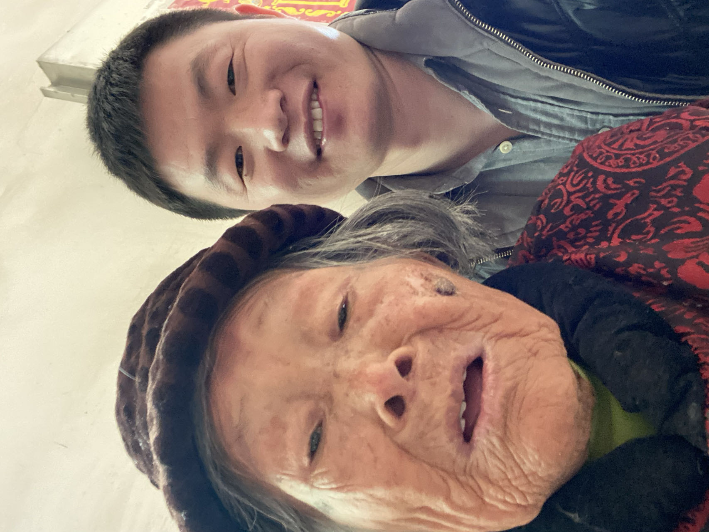
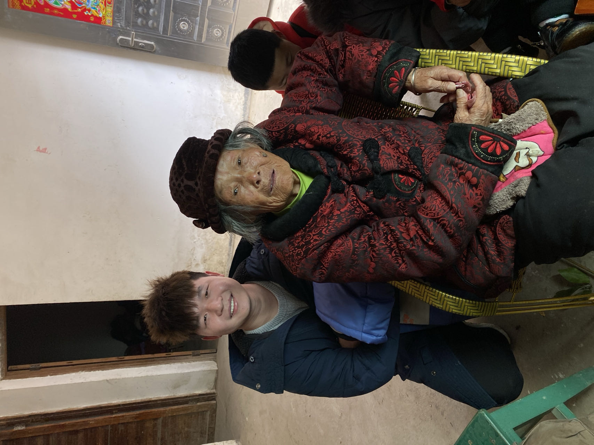

​	回眸2022年，一年的历程还算平坦，没啥惊心动魄的时刻；

​	在年末近关，外公在20230104这天的下午走了；外公这辈子操劳的很，外公年老的时候，我们在一起，总喜欢跟我讲他年轻时候的故事，在毛泽东的那个年代，生产大队的事情；与其外公当村长，做的事情；外公喜欢讲这些；没经历过那些年代，很难想象的出那些事情；

​	外公的真名叫李欠生，1933年08月04日出生，91岁的时候走了；

​	

​	外婆的真名叫邵玉妹，1934年11月25日出生，90岁的时候走了；

​	

​	外公外婆如果照顾得当，估计现在还能健在，是我们后辈没有能力让他们的福分留在这人间；

​	外公对我们比较慈祥，外婆有时候很严厉，听大舅讲，他们俩经常拌嘴，谁也不饶谁；外公体型是高大，做事公道；但也吃了一辈子的苦，苦的是我们后辈没能有能力让他老人家享享福；年龄大的外公时常的糊涂，但也很听话了，有时候看着不是滋味，但自己又无能为力；等有些能力了，他们已经远去；

​	父母在，不远游；父母事；事必躬亲。

​	2022年，大舅因为正月初九脑出血，去了县中医院，在中医院又再次脑出血昏倒，送到九江人民医院，人就废了，耽误了最佳的治疗时间，都是没钱造成的；现在就是植物人的状态，在医院治疗没啥进展，叫救护车拖回家里了，现在是活一天算一天的；唉，我的大舅啊，命苦！希望能有奇迹出现！！！

​	正月初五，办了我们的婚礼，用的都是老丈人那边的车；正月初六办了女儿出生的酒席，静爸妈给了一万块；结婚静爸妈给的钱有：在她家办酒席花了5.8w，双方各出一半；算上我买新郎装，静爸给了一万；然后是正月来我家，静家来了三辆车油钱算3k，让静给静爸，静爸没收；貌似就这些。
